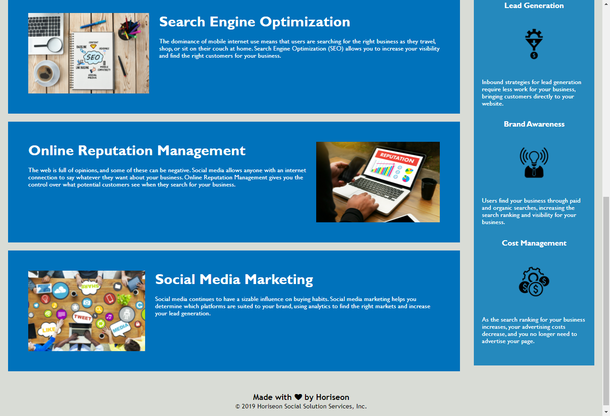

# HTML CSS Git Challenge: Code Refactor - by Zhanzhan Liu

## Purpose
To make the starting code into a codebase that follows accessibility standards meeting all acceptance criteria without influencing the operation of the sites.

## Build with 
* HTML
* CSS

## Website
https://zhanzhanliu.github.io/first-week-assignment/

## Respository Link
https://github.com/zhanzhanLiu/first-week-assignment

## Modifications to the starter code
* Added a title.
* Change div to semantic HTML elements
* Add alt attributes to each img element
* Change the nav into an ordered list and adjust the CSS accordingly
* Add comments on CSS and html to make it clear to read

## Screenshots after editing 

